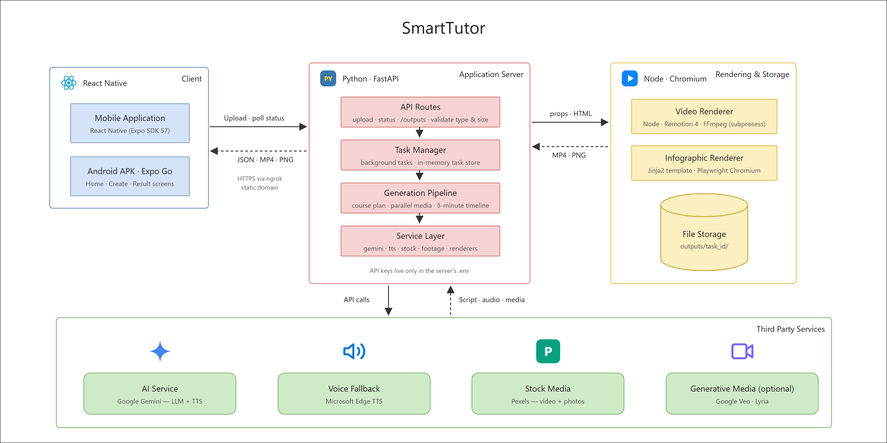
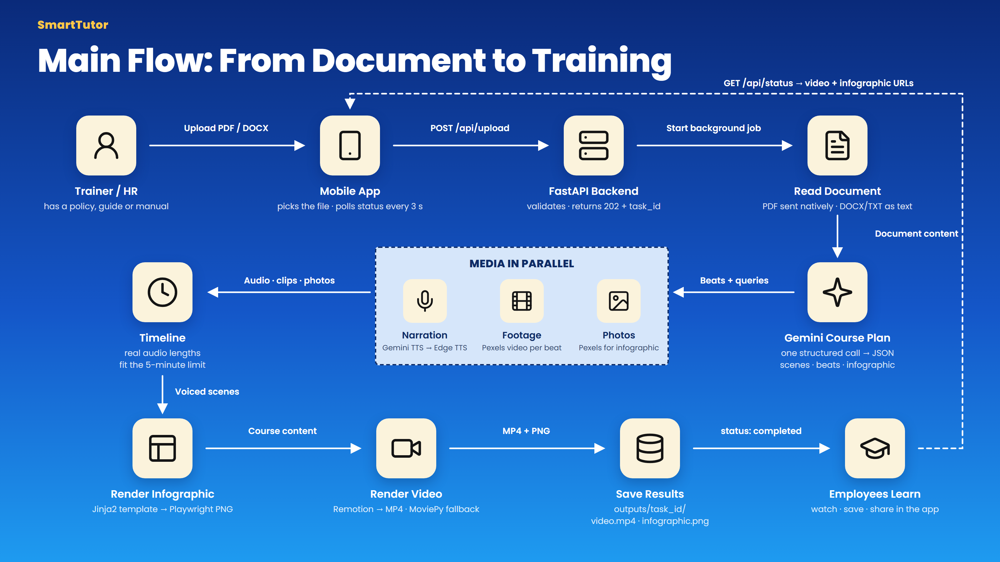

# SmartTutor — turn any document into a training course

SmartTutor is a mobile app that takes **one document** (PDF, DOCX, TXT or Markdown) and uses AI to produce two training materials that teach its content:

- **A narrated training video** (always under 5 minutes) with real footage, voice-over, on-screen key points and captions.
- **An infographic** — a one-page visual cheat sheet with key ideas, numbers, a step-by-step process, do/avoid tips and a quick self-check question.

It works for any topic (technology, business, science, hobbies…) and any of the supported languages: the course is written and narrated in the language of the uploaded document.

**Demo video:** [watch on Google Drive](https://drive.google.com/file/d/1V61qtdtnkhVXQYMiUKAvyto8urZ1SL8Q/view?usp=sharing) · **APK (Android):** [download](https://expo.dev/artifacts/eas/DbO3SDp_J0N8xcTxjnsoOTtxQPTCmKXKMSmsoIhyhEE.apk) · Test documents and generated examples: [`samples/`](samples/)

> **Backend availability.** To avoid cloud hosting costs, the backend runs on the developer's laptop and is exposed at a fixed public URL (`https://subtentacular-apogamously-tiffany.ngrok-free.dev`) that the APK is built with. **It is online only while the laptop is running it**, so outside those times the app opens but generation fails with *"Cannot reach the server"*. To test the APK, please contact me and I will start the server (`start-backend.bat`) for the agreed time. The demo video shows the full flow in the meantime, and [Running the project](#7-running-the-project) explains how to run everything locally. See [Known limitations](#known-limitations-of-this-version).

---

## Contents

1. [Architecture overview](#1-architecture-overview)
2. [AI tools and services used](#2-ai-tools-and-services-used)
3. [Technical decisions](#3-technical-decisions)
4. [Challenges encountered](#4-challenges-encountered)
5. [Future improvements](#5-future-improvements)
6. [Project structure](#6-project-structure)
7. [Running the project](#7-running-the-project)
8. [API reference](#8-api-reference)
9. [Configuration](#9-configuration)
10. [Credits and licences](#10-credits-and-licences)

---

## 1. Architecture overview

### System architecture



| Component | Responsibility | Technology |
|---|---|---|
| Mobile app | Pick a document, upload it, show progress, play and share the results. Holds no API keys. | Expo SDK 57, Expo Router, expo-video |
| Public endpoint | Gives the laptop-hosted backend a fixed HTTPS URL that the APK is built with. | ngrok static domain |
| API layer | Validates uploads (type, 15 MB), creates a task, returns `202` + `task_id`, reports status, serves output files. | FastAPI, Uvicorn |
| Task store | Status, progress step and result URLs of each task. | In-memory dict (Redis/DB in production) |
| Generation pipeline | Runs in the background: document → AI course plan → media in parallel → timeline → renders. | Python, `concurrent.futures` |
| Video renderer | Turns the timeline into an animated MP4 frame by frame; reports progress as JSON lines. | Node, Remotion 4, FFmpeg (MoviePy fallback) |
| Infographic renderer | Fills the HTML template and screenshots it as a PNG. | Jinja2, Playwright Chromium |
| File storage | One folder per task with `video.mp4` and `infographic.png`. | Local disk (S3/R2 in production) |
| External services | Content writing, narration, footage and photos. All API keys live only in the backend's `.env`. | Gemini, Edge TTS, Pexels |

### Main flow: generation pipeline



### Request flow

1. **Upload.** The app sends the document to `POST /api/upload`. The server stores it, creates a task and returns a `task_id` immediately (HTTP 202). Generation takes 3–4 minutes, so it runs in the background and the app polls `GET /api/status/{task_id}`, which reports a percentage and a human-readable step ("Finding footage, recording voiceover…").
2. **Course plan (one AI call).** Gemini reads the document (PDFs are passed natively, so tables and layout are understood) and returns a single JSON object that follows a strict schema:

   ```
   TrainingContent
   ├── title, language, summary, recap
   ├── scenes[5–7]
   │   └── beats[2–4]            ← the smallest unit of the video
   │       ├── narration          what the voice says (1–2 sentences)
   │       ├── bullet             the on-screen point shown while it is said
   │       ├── footage_query      stock-video keywords for this beat
   │       └── shot               a cinematic prompt (used when Veo is enabled)
   └── infographic
       ├── subtitle, topic_icon, hero_photo_query
       ├── stats[0–3]             only numbers found in the document
       ├── concepts[3–4]          heading, icon, photo_query, points
       ├── steps[3–5], tips {do, avoid}, quiz {question, answer}
       └── takeaway
   ```
3. **Media in parallel.** Two thread pools run at the same time: a fast pool for speech, and a pool for slow network media (stock video and photo downloads, optional Veo renders), so a slow download never blocks the voice-over.
4. **Timeline.** Each beat's real audio length is measured. Scenes are dropped from the middle (never the intro or recap) until the video fits the 5-minute limit with a safety margin (4:50).
5. **Infographic.** The JSON fills a hand-designed HTML template (Jinja2); Playwright's headless Chromium screenshots it as a 1080 px-wide PNG.
6. **Video.** Python calls a Remotion project (React + TypeScript) that renders every frame: an animated intro, one scene per lesson with full-screen footage that cuts on every beat, bullets that slide in exactly when they are spoken, captions, transitions, a progress bar and a recap/takeaway outro. Output: 1280×720, 30 fps, H.264/AAC, `yuv420p` + `faststart` so it streams on any phone.

### Resilience

Every step except the course plan has a fallback, so one failing service degrades the result instead of breaking it:

| Step | Primary | Fallback |
|---|---|---|
| Narration | Gemini TTS, rotating across 5 TTS models as daily quotas run out | Microsoft Edge neural voices (free). If voices got mixed mid-course, the whole course is re-voiced with one narrator. |
| Footage | Pexels stock video (optionally Veo for the first shots) | Reuse another clip from the same scene, then a Ken Burns move on an AI photo (if scene photos are enabled), then a gradient |
| Infographic photos | Pexels photos | Layout without photos |
| Video render | Remotion (animated) | MoviePy + FFmpeg slideshow |
| Veo | — | A circuit breaker switches Veo off for the rest of the course on the first quota error |

---

## 2. AI tools and services used

| Purpose | Service / model | Why |
|---|---|---|
| Understanding the document and writing the course | **Google Gemini `gemini-3.8-flash`** with a JSON response schema | Reads PDFs natively, long context (whole documents fit), structured output, low cost |
| Narration | **Gemini TTS** (`gemini-3.8-flash-tts` → `-lite-tts` → `3.1` / `2.5` TTS models) | Natural voice, multilingual |
| Narration fallback | **Edge TTS** (Microsoft neural voices) | Free, no key, covers English, Vietnamese and Indonesian |
| Video footage | **Pexels Video API** | Real, royalty-free HD footage; free; chosen per sentence by keywords the AI writes |
| Generated footage (optional) | **Google Veo 3.1 Lite** (`veo-3.1-lite-generate-preview`) | Truly AI-generated shots for key moments; off by default because of cost and quota |
| Infographic photos | **Pexels Photo API** | Real photos avoid the "AI-generated" look |
| Background music (optional) | **Google Lyria** (`lyria-3-clip-preview`) | Instrumental track looped under the voice; off by default |
| Video rendering | **Remotion 4** (React) + FFmpeg | Frame-accurate motion graphics written as code |
| Infographic rendering | **Jinja2** + **Playwright** (Chromium) | Pixel-perfect text in every language |
| Icons | **Lucide** (58 icons stored locally) | Consistent line icons; the AI must pick from this list |

Estimated cost with the default configuration: **about $0.06 per course** (one Gemini text call plus TTS; footage, photos and rendering are free). This is an estimate from published prices, not a measured bill.

---

## 3. Technical decisions

**One AI call writes the whole course.** The video script and the infographic come from the same structured response, so they always agree with each other; it is also cheaper and faster than chaining several prompts. A strict JSON schema (with required fields and an enum of icons) removes parsing errors.

**The AI writes content; code owns the design.** Image models still misspell text and cannot guarantee a consistent layout. So Gemini only produces structured content, and every pixel of text is rendered by templates we control (Remotion for the video, HTML for the infographic). Text is always correct — including Vietnamese diacritics — and every result looks designed, not generated.

**"Beats" synchronise text, voice and footage without speech recognition.** Each scene is split into beats (1–2 sentences + one bullet + one footage query), and each beat is voiced separately. Because we know exactly when each sentence starts, bullets appear when they are spoken, captions change with the voice, and the footage cuts on sentence boundaries. No Whisper/forced alignment is needed.

**Stock footage by default, generative video as an option.** Veo produces convincing shots but costs about $0.40 per 8-second clip, and in our testing the API tier allowed only about ten clips a day. Pexels footage is real, free and fast, and the AI still directs it: it chooses what to show for every sentence. The `FootageDirector` spends a small Veo budget on the opening shots when enabled and falls back to stock automatically.

**Asynchronous tasks + polling instead of a long request.** Generation takes minutes; mobile connections drop. The upload returns at once, the work runs in the background and the app polls a lightweight status endpoint, tolerating a few network errors before giving up.

**Always return something.** Per-asset failures are isolated (see *Resilience*), model pools rotate across equivalent models when a daily quota runs out, and a 402 "out of credits" error is turned into a graceful fallback everywhere except the one essential call.

**Five-minute guarantee from measured audio.** The prompt caps the narration at about 600 words, but the real limit is enforced after speech synthesis using the actual WAV durations.

**Mobile: Expo + Expo Router.** One TypeScript codebase for Android and iOS, file-based routing, and cloud builds (EAS) that produce an APK without Android Studio. `expo-video` plays the result, `expo-file-system` + `expo-sharing` save or share it. The app uses the same palette and typeface (Plus Jakarta Sans) as the infographic, so the app and what it produces look like one product.

**Backend: FastAPI + a Node renderer.** Python has the best AI/document tooling; Remotion needs Node. The backend launches the renderer as a subprocess and relays its progress (JSON lines on stdout) to the app.

---

## 4. Challenges encountered

| Challenge | What happened | How it was solved |
|---|---|---|
| **Videos looked like slideshows** | The first version was static slides + voice. | Rebuilt the video in Remotion (animated bullets, captions, transitions), then replaced still images with real footage that cuts on every sentence. |
| **Text and voice out of sync** | Estimating when each bullet should appear from word counts was inaccurate. | Introduced *beats* and voiced each one separately, so timings come from real audio lengths. |
| **Veo quota and cost** | After ~11 generated clips the API returned 429 for every request; one course needs ~15 clips. | Stock footage by default; Veo optional with a per-course budget and a circuit breaker. |
| **Daily TTS quota** | The main TTS model allows 100 requests/day; one course uses ~20. | A `ModelPool` rotates across five TTS models, never retries a daily-quota error, and falls back to Edge TTS; mixed voices are unified. |
| **Prepaid credits running out** | Repeated full test runs (and Veo) drained the credits and every call returned 402. | Cost controls: paid extras are off by default, rendering changes are tested with cached assets, and 402 is handled gracefully. |
| **Slow rendering** | 26 s of video took 86 s to render. | Profiling showed ~45 s was webpack bundling on every render. Bundles are now cached by a hash of the renderer sources (pre-built in Docker); the static asset server supports HTTP range requests; render concurrency was tuned. Result: about real time (26 s → 27 s). |
| **Generation still takes minutes** | A course takes about 3–6 minutes end to end (the last real run: 3 min 41 s for a 2:07 video). The render stage dominates: Remotion draws every frame (30 fps) in headless Chrome and encodes it with FFmpeg, which on a laptop CPU runs at roughly real time, so a 4-minute video needs about 4 minutes of rendering. Gemini writing the course adds 15–30 s and the parallel media stage 30–60 s. | Made the wait predictable instead of hidden: the upload returns at once, the render reports progress frame by frame, and the app shows each stage with a checklist. Real speed-ups need more compute (see *Faster generation* in Future improvements). |
| **The infographic looked "AI-generated"** | A glossy AI hero image and identical cards. | Redesigned after professional education infographics: real photos in arch frames, zig-zag layout, alternating bands, a thin numbered timeline, do/avoid columns and a quiz note. |
| **Upload failed on iPhone (Expo SDK 57)** | The classic React Native `{ uri, name, type }` FormData object was no longer sent by `fetch`. | Upload with `File` from `expo-file-system` (a `Blob`) and `expo/fetch`. |
| **Media URLs behind proxies** | Absolute URLs built by the server were `http://` behind HTTPS tunnels and were blocked on iOS. | The API returns relative paths; the app prefixes its own base URL. |
| **Reaching the laptop from a phone** | Temporary tunnels expired and campus Wi-Fi blocks device-to-device traffic. | In development the app derives the backend address from the Metro host; for the APK a fixed public URL is configured. |

---

## 5. Future improvements

### Known limitations of this version

- **Laptop-hosted backend.** Chosen to keep hosting cost at zero; a server able to render video needs about 2 vCPU / 4 GB RAM. The API is reachable only while the laptop runs it, and a restart of the laptop or network needs `start-backend.bat` to be run again.
- **Task state lives in memory.** Restarting the server loses the status of running and finished tasks (the files stay in `outputs/`).
- **No limit on concurrent generations.** Each course starts its own render; several uploads at once slow the laptop down considerably. One upload at a time is recommended.
- **Generation takes minutes.** About 3–6 minutes per course, mostly video rendering at roughly real time (see *Challenges*).
- **No accounts or access control.** No login, open CORS, and generated files are never cleaned up automatically.
- **Free-tier limits.** The ngrok free plan shows a warning page to web browsers (the app sends a header to skip it) and has bandwidth limits; Gemini and Pexels daily quotas apply. When Gemini TTS quota runs out, narration falls back to Edge TTS, where Vietnamese is read by a multilingual voice.
- **Distribution.** Android gets an APK; iPhone runs the app through Expo Go only. The Dockerfile is provided but has not been validated on a cloud host yet.

### Planned improvements

- **Cloud deployment.** Run the included Dockerfile on a VM with ≥2 vCPU / 4 GB RAM (free tiers with 512 MB cannot run headless Chrome rendering), move tasks from memory to Redis or a database, and store outputs in object storage (S3 / Cloudflare R2) behind a CDN.
- **A job queue** (Celery/RQ or a managed queue) so several videos can render in parallel on separate workers, with retries.
- **Faster generation.** Render on [Remotion Lambda](https://www.remotion.dev/docs/lambda), which splits a video into chunks rendered in parallel (minutes become seconds); on a single server, use more CPU cores (`RENDER_CONCURRENCY`) or a GPU encoder. Start rendering scenes while later scenes are still being voiced instead of waiting for all media, and cache results for documents that were already processed.
- **User accounts and history**: keep past courses, re-download them, share links with a team.
- **Editable results**: let the user review the generated script before rendering, change the voice, language or length, and regenerate a single scene.
- **Smarter footage**: rank stock clips by visual similarity to the rest of the video, apply one colour grade to all clips, and use Veo only for sentences with no good stock match.
- **Talking-head presenter** (avatar lip-synced to the narration) and word-level karaoke captions.
- **More training formats**: an auto-generated quiz with scoring, flashcards, and SCORM export for company LMS platforms.
- **Push notifications** when a course is ready, instead of keeping the app open.
- **Better cost control**: per-user quotas, caching results for identical documents, and a dashboard of API spend.
- **Automated tests**: unit tests for the timeline and fallbacks, snapshot tests for the templates, and an end-to-end test with mocked AI services.

---

## 6. Project structure

```
SmartTutor/
├── mobile/                         Expo SDK 57 app (TypeScript, Expo Router)
│   ├── src/app/                    Screens: index (home), create (upload + progress), result/[taskId]
│   ├── src/hooks/                  useGenerationTask: upload + polling state machine
│   ├── src/services/               api.ts (backend client), share.ts (save/share)
│   ├── src/components/             Button, ProgressCard, TrainingVideo, Infographic
│   ├── app.json, eas.json
│   └── .env                        EXPO_PUBLIC_API_URL for release builds
│
├── backend/
│   ├── app/                        FastAPI service (Python 3.12)
│   │   ├── main.py                 Endpoints
│   │   ├── pipeline.py             Orchestrates the whole generation
│   │   ├── schemas.py              Pydantic schema the AI must follow
│   │   ├── config.py, i18n.py, tasks.py
│   │   ├── templates/              infographic.html + Lucide icons
│   │   └── services/
│   │       ├── document.py         PDF / DOCX / TXT loading
│   │       ├── gemini.py           Text, image, TTS, music, Veo + ModelPool
│   │       ├── tts.py              Gemini TTS → Edge TTS
│   │       ├── stock.py            Pexels videos and photos
│   │       ├── footage.py          Veo-or-stock decision per shot
│   │       ├── timeline.py         Beat timings and the 5-minute budget
│   │       ├── renderer.py         Infographic (HTML → PNG)
│   │       ├── remotion.py         Builds props and runs the video renderer
│   │       ├── video.py            MoviePy fallback video
│   │       └── audio.py            WAV helpers
│   ├── video-renderer/             Remotion project (React + TypeScript)
│   │   ├── src/scenes/             IntroScene, ContentScene, OutroScene
│   │   ├── src/components/         BRoll, Caption, KenBurnsImage, ProgressBar
│   │   ├── src/timeline.ts         Frame timings shared by all scenes
│   │   └── render.mjs              CLI used by the backend (bundle cache, asset server)
│   ├── requirements.txt, Dockerfile, .env.example
│
└── samples/                        Test documents and generated examples
```

---

## 7. Running the project

### Prerequisites
- Python 3.12, Node.js 20+ (developed on Node 24), FFmpeg
- A **Gemini API key** (Google AI Studio) and a free **Pexels API key**
- The **Expo Go** app on a phone for development

### Backend

```bash
cd backend
python -m venv .venv
.venv\Scripts\activate            # macOS/Linux: source .venv/bin/activate
pip install -r requirements.txt
python -m playwright install chromium

cd video-renderer && npm ci && cd ..

copy .env.example .env            # then set GEMINI_API_KEY and PEXELS_API_KEY
uvicorn app.main:app --host 0.0.0.0 --port 8000
```

Check it with `http://localhost:8000/api/health`. The first render also downloads Remotion's headless Chrome (~110 MB).

**With Docker** (bundles Node, Chromium, fonts and a pre-built renderer; provided for cloud deployment, not yet validated on a cloud host):

```bash
cd backend
docker build -t smarttutor-api .
docker run -p 8000:8000 --env-file .env smarttutor-api
```

### Mobile app (development)

```bash
cd mobile
npm install
npx expo start
```

Scan the QR code with Expo Go. Keep the phone and the computer on the same network: in development the app automatically calls the backend on the machine running Metro (`http://<that-ip>:8000`), so `EXPO_PUBLIC_API_URL` can stay empty.

### Android APK

Set the public backend URL in `mobile/eas.json` (`build.preview.env.EXPO_PUBLIC_API_URL`; `.env` is git-ignored, so EAS does not upload it), then build in the cloud with EAS:

```bash
cd mobile
npx eas-cli@latest build -p android --profile preview
```

The demo backend runs on a laptop behind a static ngrok domain; `start-backend.bat` starts the API and the tunnel together.

EAS returns a download link to the `.apk`.

---

## 8. API reference

| Method | Path | Description |
|---|---|---|
| `GET` | `/api/health` | `{ "status": "ok", "gemini_key_configured": true }` |
| `POST` | `/api/upload` | Multipart field `file` (`.pdf`, `.docx`, `.txt`, `.md`, ≤ 15 MB). Returns `202 { "task_id", "status": "queued" }` |
| `GET` | `/api/status/{task_id}` | Progress and results (below) |
| `GET` | `/outputs/{task_id}/video.mp4` · `/infographic.png` | Generated files |

```json
{
  "task_id": "9f4f2aede58c407a82947d06556aa6f0",
  "status": "completed",
  "step": "Done",
  "progress": 100,
  "title": "Customer Service Excellence Guide",
  "summary": "This course covers essential customer service skills…",
  "video_url": "/outputs/9f4f2aede58c407a82947d06556aa6f0/video.mp4",
  "video_duration": 126.7,
  "infographic_url": "/outputs/9f4f2aede58c407a82947d06556aa6f0/infographic.png",
  "error": null
}
```

`status` is one of `queued`, `processing`, `completed`, `failed`. Media URLs are relative to the API base URL.

---

## 9. Configuration

All settings are environment variables (see `backend/.env.example`).

| Variable | Default | Purpose |
|---|---|---|
| `GEMINI_API_KEY` | — | Required |
| `PEXELS_API_KEY` | — | Required for footage and infographic photos |
| `TEXT_MODEL` | `gemini-3.8-flash` | Course writer |
| `TTS_MODELS` | 5 Gemini TTS models | Tried in order as daily quotas run out |
| `TTS_VOICE` | `Kore` | Gemini voice |
| `IMAGE_MODELS` | 3 Gemini image models | Only used when `GENERATE_SCENE_IMAGES=true` |
| `VEO_CLIPS_PER_VIDEO` | `0` | Number of shots per course generated with Veo (0 = stock only) |
| `VIDEO_MODEL` | `veo-3.1-lite-generate-preview` | Veo model |
| `GENERATE_MUSIC` | `false` | AI background music (Lyria) |
| `GENERATE_SCENE_IMAGES` | `false` | AI photos as a fallback for beats without footage |
| `MAX_FOOTAGE_CLIPS` | `24` | Upper bound of clips per course |
| `MAX_PARALLEL_CALLS` / `MAX_PARALLEL_CLIPS` | `4` / `4` | Concurrency of the two media pools |
| `RENDER_CONCURRENCY` | `4` | Parallel browser tabs used by Remotion |
| `REMOTION_BUNDLE_DIR` | — | Pre-built renderer bundle (set in Docker) |

---

## 10. Credits and licences

- Stock videos and photos: [Pexels](https://www.pexels.com/license/) — free to use and modify, no attribution required (credit appreciated).
- Icons: [Lucide](https://lucide.dev) (ISC licence).
- Video rendering: [Remotion](https://www.remotion.dev) — free for individuals and small teams; larger companies need a [company licence](https://www.remotion.dev/license).
- Fonts: Plus Jakarta Sans and Be Vietnam Pro (Google Fonts, SIL Open Font Licence).
